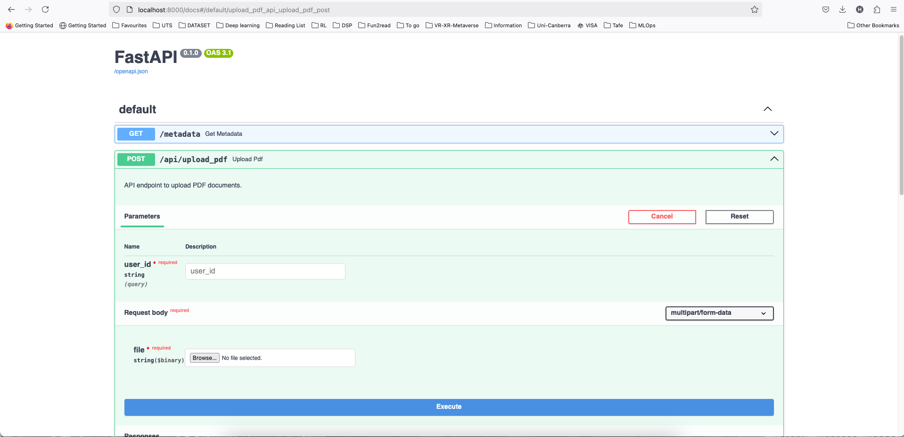
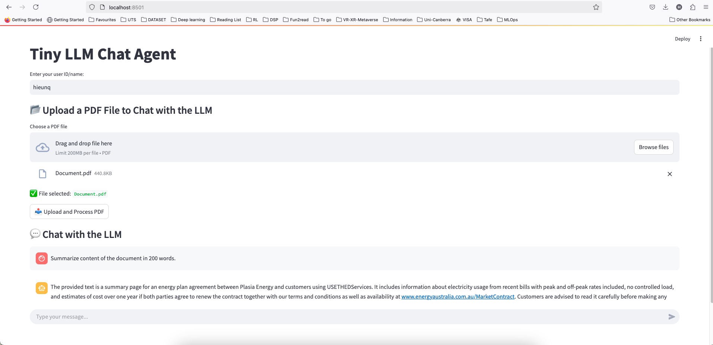
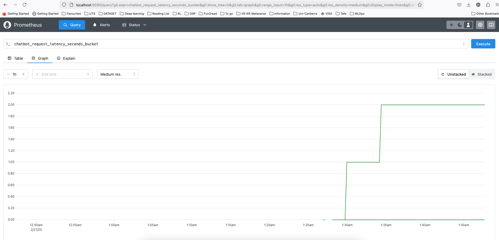
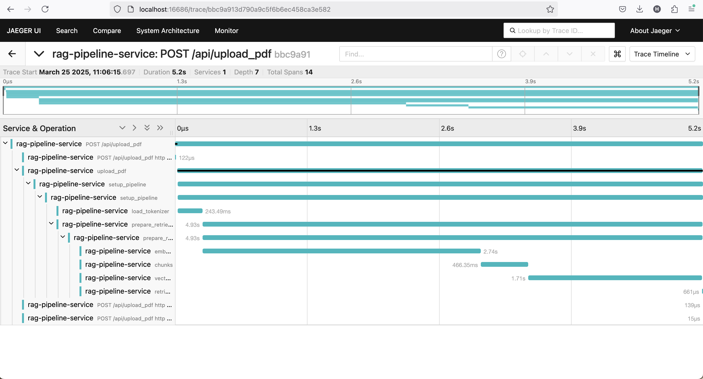

# 🚀 Tiny LLM Chat Agent

[](https://app.codecov.io/gh/hieunq95/tiny-llm-agent)

A **FastAPI + Streamlit** based **Retrieval-Augmented Generation (RAG) chatbot**, designed to chat with users using local **large language models (LLMs)** while allowing **PDF uploads** for context-aware conversations. The system leverages the **Qwen-2.5:0.5B-Instruct** model, a lightweight LLM optimized for **efficient on-device processing**. This minimum setup ensures **fast response times** while enabling **customized knowledge retrieval** from uploaded documents, making it ideal for research, study, and technical applications.

**Disclaimer**: The `tiny-llm-agent` is provided for the demonstration purpose. It is implemented to run on CPU to ensure compatibility with most hardware devices. Additionally, the response length is limited to a fixed number of tokens because the small LLM cannot efficiently handle very long contexts. Expanding beyond these limitations can be achieved by using a larger model (e.g., Qwen2.5-7B) and enabling GPU processing for faster responses. See [rag-pipeline/notebooks/poc-rag-code.ipynb](rag-pipeline/notebooks/poc-rag-code.ipynb), [rag-pipeline/src/main.py](rag-pipeline/src/main.py), and [rag-pipeline/Dockerfile](rag-pipeline/Dockerfile) for detailed implementation and configuration.

**Architecture** of the platform is as follows:   
  

The main building blocks of the system depicted in the image can be described as follows: 
- A user sends a query, which is processed through embedding and retrieval vectors.   
- The system retrieves relevant data from the FAISS vector database and monitors the process.  
- The response is displayed to the user, while monitoring and tracing are handled by tools like Jaeger Tracing, Prometheus, and Grafana.  
- Developers push code to GitHub, triggering a CI/CD pipeline via Jenkins for building and testing.  
- Docker images are pushed to Docker Hub and pulled by the application cluster on Google Cloud, which runs on Kubernetes. The application is accessible via Streamlit UI on port 8501 with an external IP.
  
## 📌 Features
✅ **FastAPI backend** to handle local LLM inference and document retrieval.  
✅ **Streamlit frontend** for lightweight and interactive chat experience.  
✅ **RAG support** to enrich personalized chat experience.  
✅ **Automatic deployment** with Docker and Kubernetes.  
✅ **LLM runs locally**, no external APIs required.  
✅ **Monitoring services** provide dashboards that measure system performance (e.g., chat response time, CPU usage) using Prometheus, Grafana, and Jaeger tracing.  
✅ **CI/CD** for automatic testing and building containers with Jenkins.  
✅ **Cloud support** for hosting LLM on Google Cloud Platform using Google Kubernetes Engine.

---

## 📂 Project Structure
```
tiny-llm-agent/  
│── docker-compose.yaml       # Docker setup for backend & frontend  
│── Jenkinsfile               # Jenkinsfile for CI/CD pipeline
│
├─ rag-pipeline/              # Backend (FastAPI)  
│ ├─── vector_store/          # Vector database (FAISS)  
│ ├─── examples/              # Example PDF files  
│ ├─── models/                # Local model storage  
│ ├─── notebooks/             # Notebooks for PoCs  
│ ├─── src/                   # Source code  
│ ├─── test/                  # Pytest code 
│ ├─── uploaded_pdfs/         # Uploaded user PDFs  
│ ├─── vector_store/          # FAISS vector database  
│ ├─── Dockerfile             # Backend Docker configuration  
│ ├─── requirements.txt       # Backend dependencies  
│
├─ streamlit/                 # Frontend (Streamlit)  
│ ├─── main.py                # Streamlit UI logic  
│ ├─── requirements.txt       # Frontend dependencies  
│ ├─── Dockerfile             # Frontend Docker configuration  
│
├─ grafana/                   # Monitoring service (Grafana)  
│
├─ prometheus/                # Scraping metrics from backend (Prometheus)  
│
├─ jenkins/                   # CI/CD pipeline using Jenkins
│
├─ kubernetes/                # Local deployment & cloud deployment
│  
└── README.md                 # Project Documentation  

```

## 📦 Project Dependencies
- Docker desktop version 27.3.1  
- Docker Compose version v2.30.3-desktop.1  
- Kubectl version v1.32.2
- Helm version v3.17.1  

## 📖 Table of Contents
- [1. Local Deployment Using Docker](#1-local-deployment-using-docker)
  - [Clone the Repository](#clone-the-repository)
  - [Deployment with Docker](#deployment-with-docker)
  - [FastAPI Backend](#fastapi-backend)
  - [Streamlit UI](#streamlit-ui)
- [2. Monitoring Services](#2-monitoring-services)
  - [Prometheus](#prometheus)
  - [Grafana](#grafana)
  - [Jaeger tracing](#jaeger-tracing)
- [3. CI/CD](#3-cicd)
- [4. Google Cloud Deployment](#4-google-cloud-deployment)
---

## 1. Local Deployment Using Docker
### Clone the Repository
```bash
git clone https://github.com/hieunq95/tiny-llm-agent.git
cd tiny-llm-agent
```

### Deployment with Docker
Using `docker` desktop version `27.3.1`, run: 
```bash
docker-compose up --build
```  

Once running:
```bash
Backend (FastAPI) → http://localhost:8000
Frontend (Streamlit) → http://localhost:8501
Monitoring (Prometheus) → http://localhost:9090
Dashboard (Grafana) → http://localhost:3000
```

#### To stop:

```bash
docker-compose down
```

#### To rebuild:  
Delete Docker images (optional):
```bash
docker image remove -f $(docker images -aq)
```
Rebuild new images:
```bash
docker-compose up --build
```

### FastAPI Backend
Access FastAPI documentation at `http://localhost:8000/docs`.  
Select one entry, e.g., `api/upload_pdf`, and then select `Try it out` to send a `post` message to the backend server.


### Streamlit UI  
Go to `http://localhost:8501/`, enter your user name, upload PDF file, and start chatting with the Tiny LLM Chat Agent.


Note: If error `Device or resource busy: '/rag-pipeline/vector_store` appears when uploading a PDF, it may be due to vector storage being in use. Simply retry the upload.  

---

## 2. Monitoring Services

### Prometheus
Scrape metrics, such as LLM response latency, CPU/GPU usage, etc, from the backend.



### Grafana
Dashboard: Visualize LLM response latency, CPU/GPU usage.  
See [grafana/README.md](grafana/README.md) for quick visualization set up.


### Jaeger tracing
Use Jaeger tracing to monitor and troubleshoot request flows of the services.  


## 3. CI/CD
### 
Details on building CI/CD pipeline with Jenkins can be found in [jenkins](jenkins/README.md) directory.

## 4. Google Cloud Deployment
- Details about deploying all services on a Google Cloud Platform (GCP) can be found in the [kubernetes](kubernetes/README.md) directory.  

- For a quick demo of the `tiny-llm-agent` chatbot on GCP, see video recap below. For the full video demo, check this [YouTube](https://www.youtube.com/watch?v=v5vP3bfA6qU) link.  

